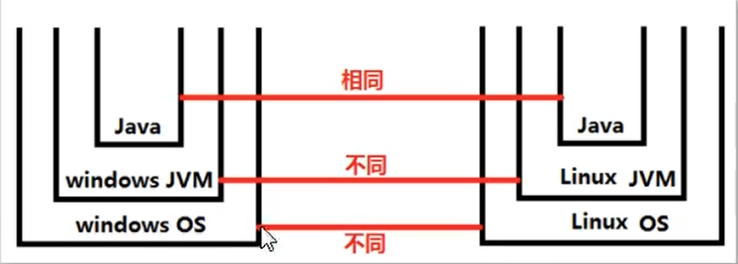
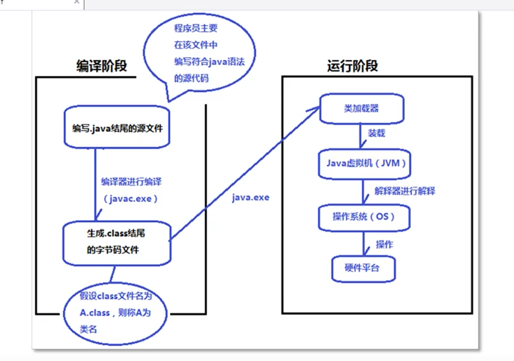

## Java程序实现原理

- 编译源代码文件，将其形成*.class文件：`javac Hello.java`(控制台输入的指令)，会形成“ Hello.class”文件（二进制的字节码文件）；

- 解释java程序：控制台输入`java Hello`,控制台打印出`Hello World! `

- 放源码的文件扩展名必须是：xxx.java

- 编译生成的字节码文件扩展名是：xxx.class

- 字节码**不是**二进制文件，字节码由java虚拟机（JVM，用c++语言实现的虚拟的计算机）处理成二进制，然后操作系统再执行二进制指令和硬件平台进行交互。不同操作系统上相同的java程序编译生成的字节码是相同（编译器编译机制是相同的）从而实现在windows系统编写的程序可以在Linux系统上运行。 

- java虚拟机（JVM）可以**操作内存**，是在JDK中的，有windows版JDK，Linux版JDK等等。

  

- JDK、IRE、JVM之间的关系

  JDK（java开发工具箱）包括JRE（java运行环境），JRE包括JVM（java虚拟机）；JDK和JRE可以独立安装（当给客户部署项目时只需要安装JRE就可以，**不需要安装JDK**）

  

**一个java文件可以有多个class文件**

## java程序从开发到最终运行

- 编译期：（可以在windows上）

  第一步：在硬盘上新建一个xxx.java文件

  第二步：在xxx.java文件中编写源代码

  第三步：使用编译器（javac (JDK安装后自带的)）对xxx.java文件进行编译

  第四步：如果编译不通过，编译器报错不会生成class文件，通过才会生成class字节码文件，一个java文件可以生成多个class文件。（编译实质上是检查语法）

- 运行期（JRE在起作用）：（可以在windows上或其他操作系统上（os））

  第五步：如果是在Linux上运行，需要将windows上生成的class文件拷贝过去不需要拷贝源代码，真正运行的是字节码。

  第六步：使用JDK自带的一个命令/工具：`java.exe`（负责运行的命令/工具）,然后启动类加载器（classloader）去硬盘上找“类”对应的“字节码”文件（类名.class文件），找到后类加载器会将字节码文件装载到 JVM 中

  第七步：JVM会将字节码文件进行解释（解释器负责将字节码解释为二进制）

  第八步：JVM将字节码交给操作系统，操作系统会执行二进制码和硬件进行交互。

**path环境变量的作用**

path环境变量的作用就是给windows操作系统指路的，告诉操作系统去哪里找这个命令文件。路径与路径之间用**半角分号（英文的）**分隔。

path环境变量本质上是属于windows系统的。

**classpath环境变量**

当在控制台用`java 类名`执行程序时，默认情况下类加载器会从当前路径下（即class文件所在的目录）找。

要想让类加载器去指定的路径下加载字节码文件，可以设置一个classpath环境变量。

classpath环境变量隶属于java给类加载器指路,不属于windows操作系统。

classpath=A路径；B路径……（classpath是一个变量名，A路径；B路径……是变量值）

**重点**：配置了“classpath=D：\course”之后，类加载器只会去“D：\course”目录下找“*.class”文件，再次在控制台class所在的路径（不在“D：\course”目录中）下执行`java 类名`时会报错。

## Dos命令

可以通过Dos命令窗口完成文件的新建、编辑删除等操作。

1、mkdir ab(创建一个文件夹ab)，mkdir: make directory ；del ab（删除文件）；cls (清屏);dir (查看当前目录下有什么)

2、在窗口复制内容

win7:选中内容，点击右键，标记

win10：选中内容，右键单击一下。

3、切换盘符

直接输入盘符然后回车（例，`d:回车`）

4、**切换目录**

使用`cd  路径`命令完成目录切换，cd(change directory)。

**相对路径**：从形式上看，相对路径一定不会以盘符开始的，是相对于当前所在“'位置'而言的。 <C：\User\Adminstrator>cd Boot   此时得到<C：\User\Adminstrator\Boot>；<C：\User\Adminstrator>cd   C：\User\Adminstrator\ Boot    此写法可行

**绝对路径**：在windows操作系统中凡是路径起点是盘符的都是绝对路径，如：C：\User\Adminstrator；<C：\User\Adminstrator>cd  C：\windows\system32 (得到<C：\windows\system32>)

5、回到上级目录

`cd ..`:  ".." 也是路径；回到根目录`cd \`; "."一个点表示当前路径，以后配置环境变量的时候有用。

`cd com`:进入com文件

6、Tab 键自动补全

7、怎么查看本机的IP地址？

IP地址：计算机在同一个网络中的省份证号（唯一标识）。

`ipconfig` 查看IP地址的配置信息

`ipconfig /all` 查看详细信息，网卡的物理地址（MAC地址）具有全球唯一性。

8、查看两台计算机能否正常通信

语法格式：`ping IP地址`（ping 61.135.169.121;后面加上“-t”会循环执行用以查看**网络是否稳定**，若想强行终止“ctrl+c”组合键）或`ping 域名` (ping  www.baidu.com)；“https://ww.baidu.com”：用域名访问百度（底层还是被解析成IP地址的形式）；“http://61.135.169.121”:用IP地址访问百度

9、文本编辑快捷键（提升开发效率）

剪切  “ctrl+x”    ;             全选  "ctrl+a"  ;              重做(与撤销“ctrl+z”相对应)  “ctrl+y”  ；            回到行首   “home键” ；     回到行尾   “end键” ；   **当光标在行尾**选中当前行   “shift+home键” ； **当光标在行首**选中当前行 “shift+end键” ； 回到文件头（顶部）  “crtl+home键”  ；         回到文件尾（底部） “ctrl+end键” ； 

选中一个单词  “ctrl+shift+右箭头/左箭头” ； 

 **输入法不见了怎么解决？**

WIN+R，然后输入`ctfmon`即可。

