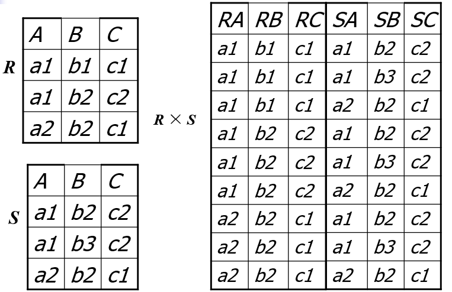
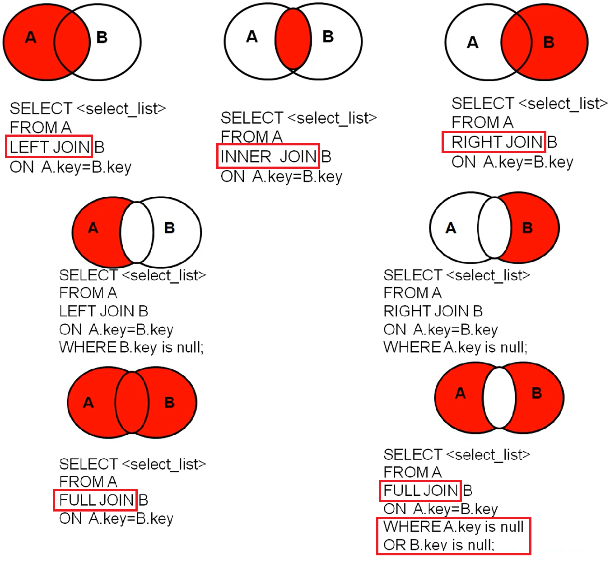
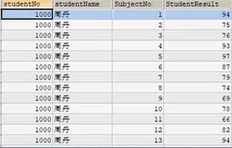
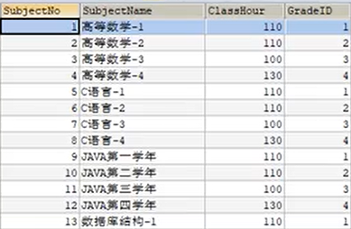

## 多表查询

多表查询是基于**一对一 、一对多、多对一、多对多**的表关系的，在进行多表查询前我们先简单了解一下前置知识。

### 1、笛卡尔积

假设: `R` 为 `n` 度（可以理解为有`n`列），有 `k1` 个元组（可以理解为有`k1`行）； `S` 为 `m` 度，有 `k2` 个元组

结果：`R × S` 为 `m+n` 度，有个 `k1 * k2` 元组



传统的集合运算，如并、交、差、广义笛卡儿积，这类运算将关系看成元组的集合，其运算是从关系的 “水平” 方向即行的角度来进行的。

### 2、内连接、外连接

按功能分类：

 内连接：等值连接、非等值连接、自连接

外连接：左外连接、右外连接、全外连接

**sql99 标准**：【】（中文括号内的内容可以省略）

语法：查询语句中涉及的关键字及执行先后顺序。

```sql
SELECT 查询列表			  7
FROM 表1 别名 【连接类型】  1
JOIN 表2 别名              2
ON 连接条件				  3
【 WHERE 筛选条件】		 4
【 GROUP BY 分组】		   5
【 HAVING 筛选条件】		 6
【 ORDER BY 排序列表】	  8
【 LIMIT 偏移,条目数】		 9
```

> from子句 --> JOIN --> ON --> where子句 --> group by子句 --> having 子句 --> select子句  --> order by子句

#### 2.1、内连接：inner  **（inner可以省略）**

特点：

- 内连接的结果相当于多个表的交集。（将一个A表的每一行依次与另一个B表的每行数据进行比较，AB表中都存在才显示出来，反之不显示）
- n 表连接至少需要 (n-1) 个连接条件

##### 1、等值连接

```sql
#查询员工名、部门名、工种名，并按部门名降序
SELECT last_name,department_name,job_title
FROM employees e
INNER JOIN departments d ON e.department_id=d.department_id
INNER JOIN jobs j ON e.job_id=j.job_id
ORDER BY department_name DESC;
/*三表连接的前提条件：
1、连接条件要跟在要连接的表的后面。
2、第三张中要有和前两张合并成的大表，有可以连接的条件。
*/
```

##### 2、非等值连接

```sql
# 查询员工的工资和工资级别
SELECT salary,grade_level
FROM employees e
INNER JOIN job_grades g 
ON salary BETWEEN g.lowest_sal AND g.heightest_sal;
```

##### 3、自连接

格式：与等值连接相似，只是一个表与自身连接。

注意：`FROM` 后的`<表名1>`与`<表名2>`完全相同，无法区分，所以要起别名。

核心：将一张表看成两张表。

```sql
# 员工的编号姓名薪资入职时间和对应经理的姓名，及部门名称
select e.id,e.name,e.salary,e.joinTime,m.name '经理姓名',d.name '部门名称'
from t_emp e inner join t_emp m on e.mgrId = m.id
```


#### 2.2 外连接

1、应用场景：用于查询一个表中有，另一个表中没有的记录。

2、特点：

1. 外连接的查询结果为主表中的所有记录

   如果从表中有和它匹配的，则显示匹配值，否则显示`null`。

   > 外连接查询结果 = 内连接结果 + 主表中有而从表中没有的记录

2. 左外连接：**left join左边的表是主表**，查询出主表的全部内容，主表对应的从表没有匹配的，则用`null`填充。

   右外连接：**rigtht join右边的表是主表**，查询出主表的全部内容，主表对应的从表没有匹配的，则用`null`填充。

   全外连接：查询出主表和从表的全部信息，不匹配的信息用`null`填充。

   > 全外连接 = 内连接的结果 + 表 1 中有但表 2 没有的 + 表 2 中有但表 1 中没有的

3. 如何确定主表？

   要查询的信息主要来自哪个表，哪个表就是主表。

```sql
#左外连接
SELECT b.name,bo.*
FROM beauty b       //主表
LEFT OUTER JOIN boys bo
ON b.`boyfriend_id`=bo.`id`;

#右外连接（查询的效果与左外连接一样）
SELECT b.name,bo.*
FROM  boys bo     
RIGHT OUTER JOIN beauty b   //主表
ON b.`boyfriend_id`=bo.`id`;
```

我们可以通过下面的图片更加形象理解**内连接**和**外连接**：




### 3、练习

题目：查询参加了考试的同学的信息：学号，学生姓名，科目名，分数

思路：

1. 分析需求，分析查询的字段来自哪些表？（可以用连接查询将表连接起来）

   来自`student, result, subject`三张表

2. 确定使用哪种连接查询 ？常用有 7 种。

   要查询的是参加考试学生的信息，所以用`RIGTH JOIN`查询。

3. 确定交叉点：这两个表中哪个数据是相同的

   学号`studentNo`

4. 判断的条件：`学生表中的 studentNo=成绩表中的 studentNo`；`学科表中的 SubjectNo=上一条查询语句结果中的 SubjectNo`

上一条查询语句结果：



`subject`表：



```sql
SELECT s.studentNo,studentName,SubjectName,StudentResult
FROM student AS s
RIGHT JOIN result AS r
ON s.studentNo=r.studentNo  //表示查询同一个人
//把上面语句查询的结果和下面的语句再做一次连接查询
INNER JOIN subject AS sub
ON r.SubjectNo=sub.SubjectNo;//表示查询同一个课程
```

多表查询思路：先查询两张表，然后再慢慢增加表。

