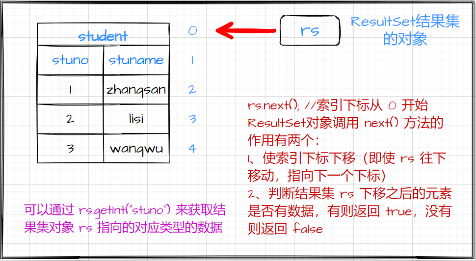

## JDBC 数据库连接

> 导读：
>
> 我们知道数据库是用来存放数据并且可以通过特定的 SQL 语句对数据库中的数据进行增加、删除、修改（也叫更新）、查询，还可以进行其他更加复杂的操作。这些操作可以通过数据库图形化界面进行，也可以通过使用其他的编程语言连接数据库然后对数据进行操作。下面我要介绍的是通过 Java 语言连接数据库并对其中的数据进行一系列的操作。

### 1、JDBC 的介绍

（Java DataBase Connectivity，Java 数据库连接对象），用来指定`Java`类与关系型数据库服务器 `Mysql,oracle, sqlserver`之间沟通规则，`JDBC`规范接口实现类由不同关系型数据库服务器厂商以`JAR`包形式提供。

> 例如：MySQL 数据库的连接`JAR`包`mysql-connector-java-5.1.7-bin.jar`

   `JDBC`是`Java`中`JDK`的一部分（存在于`java.sql`包中），`Java`访问数据库必须通过`JDBC`所提供的工具来实现。

1) `java.sql.DriverManager` 类 : 这个类存在于 JDK 1.8下。负责将数据库厂商提供 `Driver` 接口实现进行注册，负责在 Java 工程与 MySQL 服务器之间建立一个**连接通道**
2) `java.sql.Connection`接口 : 负责**管理** Java 工程与数据库服务器之间**连接通道**
3) `java.sql.Preparedstatement `接口 : 负责管理在连接通道上进行往返交通的交通工具
4) `java.sql.Resultset`接口 : 负责管理数据库服务器返回临时表

### 2、访问数据库步骤

> 执行下面步骤的前提是在 MySQL 中已经创建好了对应的数据库

1. 注册驱动

   - `Class.forName("com.mysql.jdbc.Driver"); `

     ```java
     //第一种:
     Driver driver = new com.mysql.jdbc.Driver();
     DriverManager.registerDriver(driver); //这行代码可以忽略不写
     
     //第二种: (这种方式使用较多)
     Class.forName("com.mysql.jdbc.Driver");
     ```

     作用是 : 将 `com.mysql.jdbc.Driver` 这个类装载到 JVM 当中。装载过程中会自动执行静态代码块完成驱动的注册。

   加载`JDBC`驱动程序： 在连接数据库之前，首先要加载想要连接的数据库的驱动到`JVM`（`Java`虚拟机）， 这通过`java.lang.Class`类的静态方法`forName(String className)`实现。成功加载后，会将`Driver`类的实例注册到`DriverManager`类中。

2. 产生数据库连接

   -  提供`JDBC`连接的`URL`：
      1. 连接`URL`定义了连接数据库时的协议、子协议、数据源标识。
      2. 书写形式：`协议：子协议：数据源标识`
      3. 协议：在`JDBC`中总是以`jdbc`开始
      4. 子协议：是桥连接的驱动程序或是数据库管理系统名称。
      5. 数据源标识：标记找到数据库来源的地址与连接端口。 `jdbc:mysql://localhost:3306/test?useUnicode=true&characterEncoding=gbk; useUnicode=true`：表示使用`Unicode`字符集。 如果`characterEncoding`设置为`gb2312`或`GBK`，本参数必须设置为`true&characterEncoding=gbk;`字符编码方式。（实际开发中我们使用`characterEncoding=utf-8`较多）
   -  要连接数据库，需要向`java.sql.DriverManager`请求并获得`Connection`对象，该对象就代表一个数据库的连接。
   -  `DriverManager.getConnection(url,username,password)`方法传入指定的欲连接的数据库的路径、数据库的用户名和密码来获得。

3. 产生`Statement`编译对象

   - 编译对象:`Statement st = conn.createStatement();`
   - 预编译对象:`PreparedStatement pst = conn.preparedStatement(String sql); `   继承于`Statement`对象
     -  `pst.setObject(参数下标,参数名)`为对应参数下标赋值
     -  `pst.getString(参数下标,参数名)`获取参数下标对应的值

4. 执行`sql`语句并处理结果

   - 增删改:`stat.executeUpdate(sql);`
   - 查询:`stat.executeQuery(sql);`
     - 结果集 `ResultSet rs` 
     - `rs.next() `完成两件事  1.把游标向下移动一行   2.判断当前位置是否有数据
     - `rs.getObject(列名或下标)` 或`rs.getString(列名或下标)`：获取当前位置对应的字段数据

5. 关闭资源

   **关闭资源的顺序**需要严格按照如下方式进行：

   - `rs.close()`
   - `stat.close()`
   - `conn.close()`

这五个步骤可以按照如下的方式进行记忆

>   1.将 MySQL 服务器厂商提供 Driver 接口实现类注册到 JVM
>
>   2.通过 JDBC 规范中 DriverManager 在Java工程与 MySQL 服务器之间建立一个**连接通道**
>
>   3.通过 MySQL 服务器厂商提供 Connection 接口实现类建立一个交通工具 Preparedstatement
>
>   4.通过交通工具 Preparedstatement 将 SQL 命令从Java工程推送到 MySQL 服务器上执行并带回执行结果
>
>   5.销毁本次交易过程涉及所有资源对象

```java
public static void main(String[] args) throws Exception{
    // "jdbc:mysql://服务器所在计算机IP地址:服务器端口号/数据库"
    String url = "jdbc:mysql://localhost:3306/demo";

    //sql命令
    String sql="insert into dept (deptno, dname ,loc ) values (100,'小额贷款部门','上海')";
    //1.将MySql服务器提供的jar包中Driver接口实现类，注册到JVM
    Driver driver = new com.mysql.jdbc.Driver();
    DriverManager.registerDriver(driver);
    /* 方式二：
    	Class.forName("com.mysql.jdbc.Driver);
    */
    //2.通过DriverManager在Java工程与MySQL服务器之间建立一个连接通道
    Connection con= DriverManager.getConnection(url, "root", "123");
    //3.在通道上创建一个交通工具
    PreparedStatement ps = con.prepareStatement(""); 
    //4.通过交通工具将SQL命令推送到MySQL服务器上来执行并带回处理结果
    int result = ps.executeUpdate(sql);
    //5.销毁相关资源
    if(ps != null){ //当ps=null时ps.close()会报空指针异常※
    	ps.close();
    }
    if (con != null){
    	con. close();
    }
    System.out.println("本次交易中，在表文件添加"+result+" 行数据");
}
```

### 3、`Statement` 和 `PreparedStatement` 执行 SQL 语句的过程

`PreparedStatement`继承于`Statement`对象，是`Statement`的子类，这两个对象都能实现执行 SQL 语句的功能。但是开发中我们推荐使用 `PreparedStatement` 执行 SQL 语句。

```java
//Statement
//发送sql执行增删改和查
Statement stmt = connection.createStatement();
String sql = "insert into student values(1,'zhangsan')";
//执行sql
int count = stmt.executeUpdate(sql);//返回值表示增删改了几条数据；executeQuery()查询数据返回的是ResultSet结果集
Statement stmt = connection.createStatement();
String name = "z";
//模糊查询，查询学生名中含有字符 z 的学生信息
String sql = "select * from student where stuname like '%"+name+"%'";
ResultSet rs = stmt.executeQuery(sql);//返回结果集
while(rs.next()){
    int sno = rs.getInt("stuno");
    String sname = rs.getString("stuname");
    System.out.println("学号："+sno+",学生姓名："+sname);
}


//PreparedStatement
String sql = "insert into student values(?,?)";
PreparedStatement pstmt = connection.prepareStatement(sql);//预编译
pstmt.setInt(1,12);
pstmt.setString(2,"wangwu");
//返回结果
int count = pstmt.executeUpdate();
//模糊查询，查询学生名中含有字符 u 的学生信息
String sql = "select * from student where stuname like ?";
PreparedStatement pstmt = connection.prepareStatement(sql);//预编译
pstmt.setString(1,"%u%");
ResultSet rs = pstmt.executeQuery();//返回结果集
while(rs.next()){
    int sno = rs.getInt("stuno");
    String sname = rs.getString("stuname");
    System.out.println("学号："+sno+",学生姓名："+sname);
}
```

> 1、ResultSet 结果集(查询语句返回的临时表)
>
> 
>
> `rs.next();`：使索引下标下移（**索引下标从 0 开始**），并且判断结果集 `rs` 下移之后的元素是否有数据，有返回`true`，没有返回`false`。
>
> `rs.prevous();`使索引下标上移。（使用较少）
>
> 可以通过 `rs.getInt(“stuno”) `来获取结果集对象 `rs` 指向的对应类型的数据。
>
> 2、`ps.executeUpdate`与`ps.executeQuery`区别：
>
> 1. `ps.executeUpdate`:
>    1)负责推送插入命令 `insert `，更新命令 `update`，删除命令 `delete`
>
>    2)返回结果对表文件进行操作时，收到影响行数，比如插入了多少行，更新了多少行删除了多少行
>
> 2. `ps.executeQuery`:
>
>    1)负责推送查询命令`select * from 表名`
>
> ​       2)返回结果是查询命令得到**临时表**，在 JDBC 规范中**临时表**交给 ResultSet 接口实现类管理。实际上返回 Resultset 实例对象

:star:注意：`PreparedStatement pstmt = connection.prepareStatement(sql);`和`pstmt.executeUpdate(sql);`这两种执行 SQL 语句的方式都是正确的。

```java
PreparedStatement pstmt = connection.prepareStatement(sql);
...
pstmt.executeUpdate();

/*等价于*/
PreparedStatement pstmt = connection.prepareStatement();
...
pstmt.executeUpdate(sql);
```

### 4、Statement 和 PreparedStatement 区别

（1）`Statement`参数用字符串拼接方式（使用`Statement`需要进行字符串拼接：`insert into dept (deptno, dname,Loc) values("+i+", 'dept_ "+i+"','江西'`），而`PreparedStatement`参数是采用占位符`?`方式，后者简化了处理

（2）`Statement`没有预处理功能，而`PreparedStatement`在大多数据库中有预处理功能

- `Statement`对于每一条`sql`语句都会在数据库中编译再执行查询
- `PreparedStatement`对于相同结构的`sql`语句，在数据库只编译一次

（3）`Statement`存在被 SQL 注入的风险，而`PreparedStatement`没有

- > 例如输入：用户名：`任意值' or 1=1 --`，密码：`任意值`（注意有空格或者回车时，此时的输入用`sc.nextLine();`(可以得到带空格的字符串) 代替 `sc.next()`(不可以得到带空格的字符串)）
  >
  > 
  >
  > 分析：`select count(*) from login where uname='"+name+"'and upwd='"+pwd+"';`
  >
  > 
  >
  > 把输入带入 SQL 语句：`select count(*) from login where uname='任意值' or 1=1 --' and upwd='任意值';`
  >
  > 
  >
  > 输入的用户名中的单引号和拼接语句的单引号配对，并且在SQL中`--`是注释符号，即SQL语句变成`select count(*) from login where uname='任意值' or 1=1`相当于`select count(*) from login where 1=1;`

### 5、预编译与批处理

批处理作用: 数据库一次可以做多次 SQL 操作，可以提高执行效率。

```java
//Statement
Statement stmt = connection.createStatement();
String sql = "insert into student values(1,'zs')";
for(10){
    int count = stmt.executeUpdate(sql);
}


//PreparedStatement
String sql = "insert into student values(?,?)";
PreparedStatement pstmt = connection.prepareStatement(sql);//预编译
for(10){
    //通过向预编译SQL命令填充数据生成全新的SQL命令
    pstmt.setInt(1,12);
	pstmt.setString(2,"wangwu");
    //在新的SQL语句生成之后，将SQL语句作为一颗子弹添加到pstmt的弹夹中
     pstmt.addBatch(); //addBatch()是一个List集合
    
}
pstmt.executeBatch();//一次性推送10条SQL语句
//销毁资源
/ /6.销毁资源
    if (pstmt != null){
    	pstmt.close() ;
    }
    if (connection != null){ 
    	connection.close( ) ;
    }
}    
```

### 总结

经过 JDBC 的学习我们学会了使用 Java 连接 MySQL 数据库的五个基本步骤，还知道了预编译 SQL 语句能提高执行的效率、防止 SQL 注入的安全问题。

