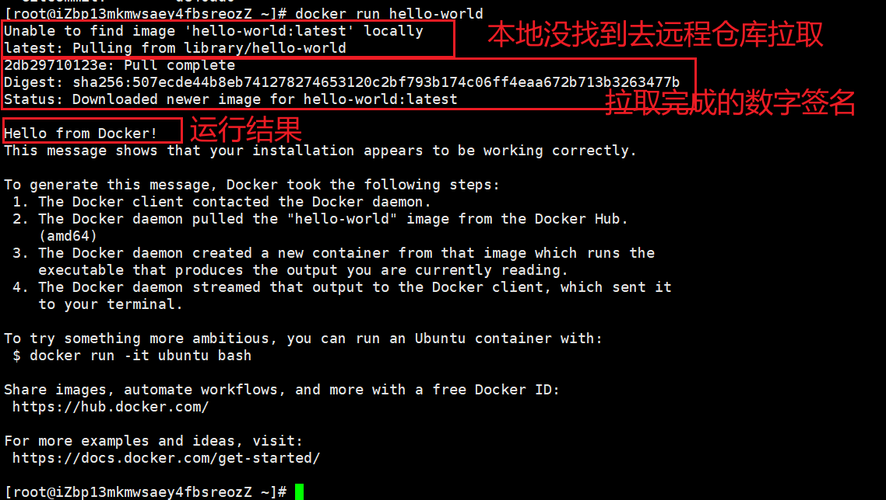
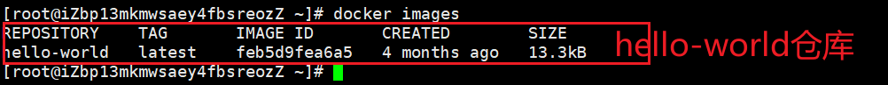

## 在 CentOS 上安装 Docker 引擎

> 本文翻译自[Docker官网](https://docs.docker.com/engine/install/centos/)

### 先决条件

#### 操作系统要求

要安装 Docker Engine，您需要 CentOS 7 或 8 的维护版本。存档版本不受支持或测试。

`centos-extras`必须启用存储库。此存储库默认启用，但如果您已禁用它，则需要 [重新启用它](https://wiki.centos.org/AdditionalResources/Repositories)。

推荐使用`overlay2`存储驱动。

### 卸载旧版本

旧版本的 Docker 被称为`docker`或`docker-engine`. 如果安装了这些，请卸载它们以及相关的依赖项。

```shell
sudo yum remove docker \
                  docker-client \
                  docker-client-latest \
                  docker-common \
                  docker-latest \
                  docker-latest-logrotate \
                  docker-logrotate \
                  docker-engine
```

`yum`如果报告没有安装这些软件包，那也没关系。

`/var/lib/docker/`的内容，包括图像、容器、卷和网络都被保留。Docker 引擎包现在称为`docker-ce`（`docker-ce`：社区版 Docker（个人学习推荐使用该版本），`docker-ee`：企业版 Docker）

### 安装方法

您可以根据需要以不同的方式安装 Docker Engine：

- 大多数用户 [设置 Docker 的存储库](https://docs.docker.com/engine/install/centos/#install-using-the-repository)并从中安装，以便于安装和升级任务。这是推荐的方法。
- 一些用户下载 RPM 包并 [手动安装它](https://docs.docker.com/engine/install/centos/#install-from-a-package)并完全手动管理升级。这在诸如在无法访问 Internet 的气隙系统上安装 Docker 等情况下很有用。
- 在测试和开发环境中，一些用户选择使用自动化 [便利脚本](https://docs.docker.com/engine/install/centos/#install-using-the-convenience-script)来安装 Docker。

#### 使用存储库安装

在新主机上首次安装 Docker Engine 之前，您需要设置 Docker 存储库。之后，您可以从存储库安装和更新 Docker。

`sudo`是[linux](https://blog.csdn.net/as604049322/article/details/120446586?ops_request_misc=%257B%2522request%255Fid%2522%253A%2522164328637616780255289484%2522%252C%2522scm%2522%253A%252220140713.130102334..%2522%257D&request_id=164328637616780255289484&biz_id=0&utm_medium=distribute.pc_search_result.none-task-blog-2~all~top_positive~default-1-120446586.pc_search_result_cache&utm_term=linux&spm=1018.2226.3001.4187)系统管理指令，是允许系统管理员让普通用户执行一些或者全部的`root`命令的一个工具，如`halt，reboot，su`等等。这样不仅减少了`root`用户的登录 和管理时间，同样也提高了安全性。`sudo`不是对`shell`的一个代替，它是面向每个命令的。

##### 设置存储库

安装`yum-utils`包（提供`yum-config-manager` 实用程序）并设置**稳定**的存储库。

```sh
 # 需要的安装包（安装Docker的依赖库）
 sudo yum install -y yum-utils

# 添加Docker CE的软件源信息（设置的镜像仓库）
 sudo yum-config-manager \
    --add-repo \
    https://download.docker.com/linux/centos/docker-ce.repo #该仓库是国外的下载速度慢可以修改成国内的镜像仓库
    
# 添加Docker CE的软件源信息（国内的镜像仓库）
yum-config-manager --add-repo http://mirrors.aliyun.com/docker-ce/linux/centos/docker-ce.repo
```

##### 安装 Docker 引擎

1. 安装*最新版本*的 Docker Engine 和 containerd，或者进入下一步安装特定版本：

   ```sh
   sudo yum install docker-ce docker-ce-cli containerd.io
   # 如果不想一个一个确认安装的包则使用下面的命令
   sudo yum -y install docker-ce docker-ce-cli containerd.io
   ```

如果提示接受 GPG 密钥，请验证指纹是否匹配 `060A 61C5 1B55 8A7F 742B 77AA C52F EB6B 621E 9F35`，如果是，则接受它。

> 如果您启用了多个 Docker 存储库，在 yum install 或 yum update 命令中未指定版本的情况下安装或更新，则总是安装可能的最高版本，这可能不适合您的稳定性需求。

此命令会安装 Docker，但不会启动 Docker。它还会创建一个 `docker`组，但是默认情况下它不会将任何用户添加到该组中。

2. 要安装**特定版本**的 Docker Engine，请在 repo 中列出可用版本，然后选择并安装：

- 列出并排序您的存储库中可用的版本。此示例按版本号从最高到最低对结果进行排序，并被截断：

```sh
yum list docker-ce --showduplicates | sort -r

# 例子：
docker-ce.x86_643:18.09.1-3.el7			docker-ce-stable
docker-ce.x86_643:18.09.0-3.el7			docker-ce-stable
docker-ce.x86_6418.06.1.ce-3.el7		docker-ce-stable
docker-ce.x86_6418.06.e.ce-3.el7		docker-ce-stable
```

返回的列表取决于启用的存储库，并且特定于您的 CentOS 版本（`e17 `就是 `CentOS 7.x` 版本； `e18`则是`CentOS 8.2`）

- 通过其完全限定的包名称安装特定版本，即包名称 ( `docker-ce`) 加上版本字符串（第 2 列），从第一个冒号 ( `:`) 开始，一直到第一个连字符，用连字符 (`-`) 分隔。例如，`docker-ce-18.09.1`。

```sh
sudo yum install docker-ce-<VERSION_STRING> docker-ce-cli-<VERSION_STRING> containerd.io
# 例如：
sudo yum install docker-ce-18.09.1 docker-ce-cli-18.09.1 containerd.io
```

此命令会安装 Docker，但不会启动 Docker。它还会创建一个 `docker`组，但是默认情况下它不会将任何用户添加到该组中。

3. 启动 Docker。

```sh
# 启动 Docker
sudo systemctl start docker
# 查看 docker 版本看是否启动成功
sudo docker version
```

4. `hello-world` 通过运行映像来验证 Docker 引擎是否已正确安装。

```sh
sudo docker run hello-world
```

此命令下载测试映像并在容器中运行它。当容器运行时，它会打印一条消息并退出。



查看下载的镜像

```sh
sudo docker images
```



其他命令：

```sh
# 查看 docker 的状态
sudo systemctl status docker
# 重启 docker
sudo systemctl restart docker
# 设置 docker 服务开启自启动
sudo systemctl enable docker
```

这将安装并运行 Docker 引擎。用于`sudo`运行 Docker 命令。继续[Linux 后安装](https://docs.docker.com/engine/install/linux-postinstall/)以允许非特权用户运行 Docker 命令和其他可选配置步骤。

##### 升级 Docker 引擎

要升级 Docker Engine，请按照[安装说明](https://docs.docker.com/engine/install/centos/#install-using-the-repository)，选择您要安装的新版本。

### 卸载 Docker 引擎

1. 卸载 Docker 引擎、CLI 和 Containerd 软件包：

   ```
   $ sudo yum remove docker-ce docker-ce-cli containerd.io
   ```

2. 主机上的映像、容器、卷或自定义配置文件不会自动删除。要删除所有映像、容器和卷：

   ```
   $ sudo rm -rf /var/lib/docker
   $ sudo rm -rf /var/lib/containerd
   ```

您必须手动删除任何已编辑的配置文件。

更多内容请移步[Docker官网](https://docs.docker.com/engine/install/centos/)自行查看。

### 阿里云镜像加速

登录阿里云在首页`产品`处选择`容器与中间件 -> 容器镜像服务 ACR -> 管理控制台 -> 镜像工具 -> 镜像加速器 `在操作文档处根据对应的操作系统进行操作即可。

1、创建一个目录

```sh
sudo mkdir -p /etc/docker
```

2、修改`daemon`配置文件`/etc/docker/daemon.json`来使用加速器

```
sudo tee /etc/docker/daemon.json <<-'EOF'
{
  "registry-mirrors": ["https://ba76625f.mirror.aliyuncs.com"]
}
EOF
```

3、重启服务

```sh
sudo systemctl daemon-reload
```

4、重启`docker`

```sh
sudo systemctl restart docker
```

### 使用Docker安装Nginx服务

1. 查看`Docker`镜像仓库中`Nginx`的可用版本。

```sh
docker search nginx
```

2. 拉取最新版的`Nginx`镜像

```sh
docker pull nginx:latest
```

3. 查看本地镜像

```sh
docker images
```

4. 运行容器。

```sh
docker run --name nginx-test -p 8080:80 -d nginx
```

命令参数说明：

- `--name nginx-test`：容器名称。
- `-p 8080:80`： 端口进行映射，将本地`8080`端口映射到容器内部的`80`端口。
- `-d nginx`： 设置容器在后台一直运行。

命令输出如下所示：

报错`Error starting userland proxy: listen tcp4 0.0.0.0:8080: bind: address already in use.`端口被占用了，可以切换成别的端口。或者可以先使用`netstat -tanlp`命令找到被那个应用占用了，然后用`kill 占用端口进程的PID`命令杀死该进程。

5. 在浏览器地址栏输入`http://<ECS公网IP地址>:8080`访问`Nginx`服务即可看到欢迎页面。如果无法访问可以先检查阿里云服务器的安全组中对应的端口（例如这里的`8080`）是否开放。

   

### 参考资料

1、一个大佬的博客：[Java 全栈知识体系](https://www.pdai.tech/md/devops/docker/docker-02-basic.html)

2、[Docker官网](https://docs.docker.com/engine/install/centos/)

3、[YoungKbt blog](https://notes.youngkbt.cn/docker/install/)

