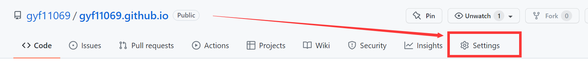
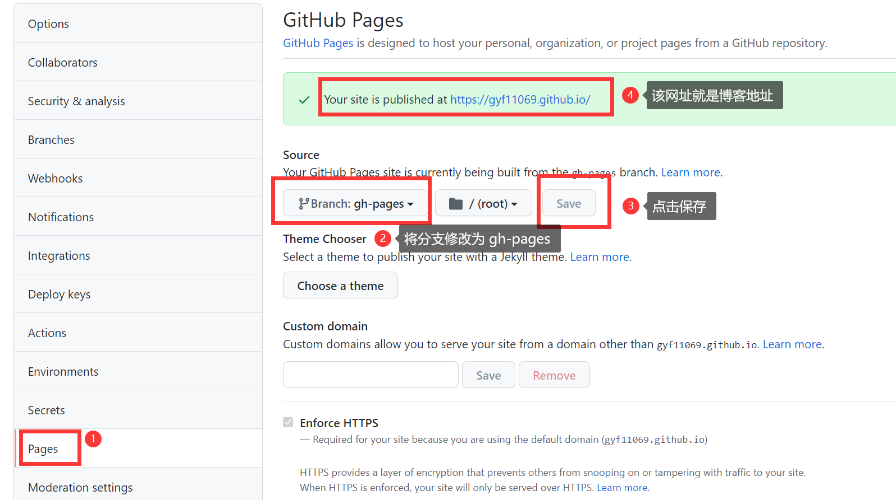
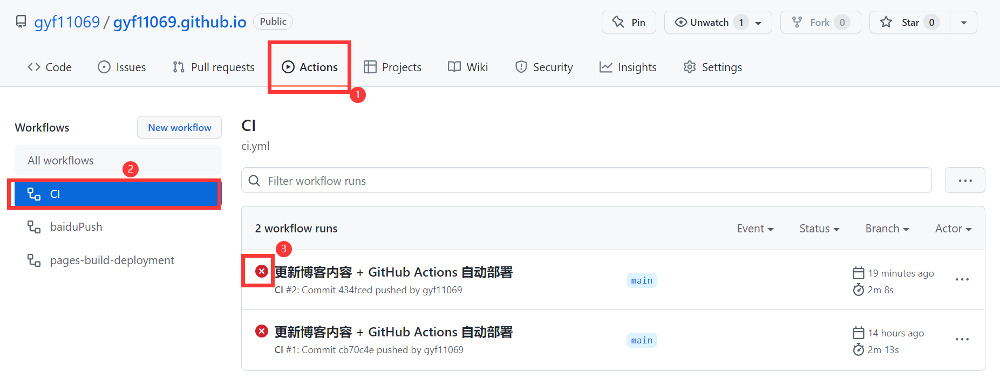
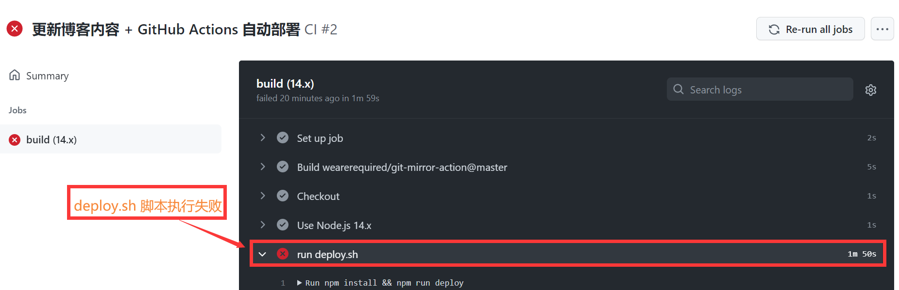
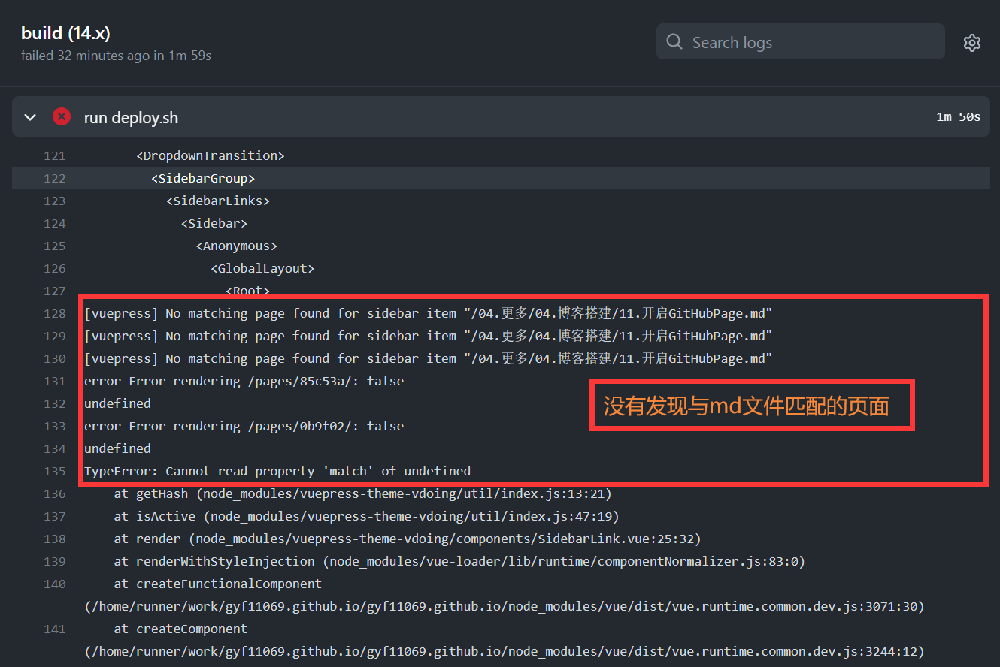
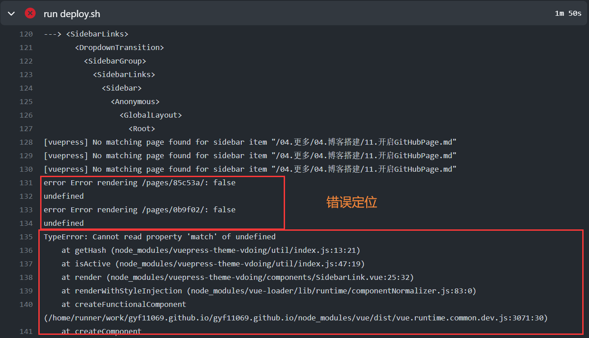

## GitHub Page 部署

打开`Github`的项目，并在项目中找到`Settings`点击进行设置。



找到`Pages`将`Source`中的分支修改为`gh-pages`（编译后的博客页面），然后点击保存，最终上方的网址就是博客的地址。



### GitHub Actions 自动部署

实现 GitHub 的自动部署，以及 GitHub 的仓库同步到 Gitee 中，最后 Gitee 将仓库同步到到服务器。

[自动化文件流程](https://notes.youngkbt.cn/about/website/deploy/#%E8%87%AA%E5%8A%A8%E5%8C%96%E6%96%87%E4%BB%B6%E6%B5%81%E7%A8%8B)

**yml 执行流程**

当把项目源码推送到仓库的 `master` 主支时，该 `yml` 文件开始执行。该文件执行的第三步，就会执行 `deploy.sh` 脚本部署文件，完成把打包文件提交到 `gh-pages` 分支下，该文件的第四步，则是把 `Github` 仓库的代码同步到 `Gitee` 仓库里，包括 `gh-pages`分支（双方仓库名字要一致），该文件第五步，则是手动点击了 `Gitee` 的更新部署按钮。（`Gitee` 自动更新部署需要 99元/年，没钱只能利用脚本手动点击按钮更新）

**yml 被执行流程**

当第一次提交项目到仓库时，`Github` 会自动在项目根目录找到 `/.github/workflows/` 下的 `yml` 文件，如 `ci.yml`，并且执行该 `ci.yml` 文件；

当第二次乃至后面提交项目到仓库时，`Github` 判断 `ci.yml` 内容是否发送变化，没有则执行仓库的 `ci.yml` 文件，有则先更新文件再执行。

`ci.yml` 文件：

```yaml
name: CI

#on: [push]

# 在 master 分支发生 push 事件时触发。
on:
  push:
    branches:
      - master

env: # 设置环境变量
  TZ: Asia/Shanghai # 时区（设置时区可使页面中的 最近更新时间 使用时区时间）

jobs: # 工作流
  build: # 自定义名称
    runs-on: ubuntu-latest # 必填，运行在虚拟机环境 ubuntu-latest

    strategy:
      matrix:
        node-version: [14.x]

    steps: # 步骤1
      - name: Checkout # 步骤1，拉取代码
        # 使用的动作。格式：userName/repoName。作用：检出仓库，获取源码。 官方actions库：https://github.com/actions
        uses: actions/checkout@v1

      - name: Use Node.js ${{ matrix.node-version }} # 步骤2
        uses: actions/setup-node@v1 # 作用：安装nodejs
        with:
          node-version: ${{ matrix.node-version }} # 版本

      - name: run deploy.sh # 步骤3：执行脚本 deploy.sh
        env: # 设置环境变量，未设置则不运行
          GITHUB_TOKEN: ${{ secrets.ACCESS_TOKEN }} # token
          SSH_PRIVATE_KEY: ${{ secrets.GITEE_RSA_PRIVATE_KEY }} # 私钥
        run: npm install && npm run deploy # 执行 deploy.sh 脚本，位于项目根目录

      - name: Push Matser To Gitee # 步骤4：GitHub 内容同步到 Gitee，同步仓库是 master
        uses: wearerequired/git-mirror-action@master
        env:
          SSH_PRIVATE_KEY: ${{ secrets.GITEE_RSA_PRIVATE_KEY }}
        with: # 从源到目的地
          source-repo: "git@github.com:gyf11069/gyf11069.github.io.git" #Github 仓库地址
          destination-repo: "git@gitee.com:gyunf/gyf11069.git" #Gitee 仓库地址

      # - name: Build Gitee Pages # 步骤5：自动部署到 Gitee Pages
      #   uses: yanglbme/gitee-pages-action@master
      #   with:
      #     # 注意替换为你的 Gitee 用户名
      #     gitee-username: gyf11069
      #     # 注意在 Settings -> Secrets 配置 GITEE_PASSWORD
      #     gitee-password: ${{ secrets.GITEE_PASSWORD }}
      #     # 注意替换为你的 Gitee 仓库，仓库名严格区分大小写，请准确填写，否则会出错.一般地址和仓库名一致，如果地址改了，仓库名不改，要以地址为准（地址仅需后缀，即 https://gitee.com/<username>/xxx 的 xxx 即可）
      #     gitee-repo: gyf11069/gyf11069
      #     # 要部署的分支，默认是 master，若是其他分支，则需要指定（指定的分支必须存在）
      #     branch: gh-pages

```

将远程推送的操作写成`push.sh`脚本：

```sh
#!/usr/bin/env sh

# 本脚本为自动部署的入口脚本，只需执行该脚本，即可实现 GitHub 的自动部署，以及 GitHub 的仓库同步到 Gitee 中，最后 Gitee 将仓库同步到到服务器

GITHUB_REPO=git@github.com:gyf11069/gyf11069.github.io.git

comment=$1

if [ ! $comment ]; then
comment="更新博客内容 + GitHub Actions 自动部署"
fi

git add -A

git commit -m "${comment}"    # $1 是启动该脚本传来的参数，如 sh push.sh hello，其中 hello 就会插入到 $1 处，如果想两个参数，则加 $2

git push $GITHUB_REPO   
```

写完文章后，直接在根目录使用`git`执行如下命令即可将代码推送到`Github`上。

```sh
# 执行推送脚本
sh push.sh
```

所遇问题：

1、执行`push.sh`脚本后`Github`仓库中的`gh-pages`分支下的文件没有推送成功。

问题分析：

查看`docs/.vuepress/dist`文件夹还未删除，如果执行了`deploy.sh`脚本的话就会删除该文件夹，由此可知`deploy.sh`脚本没有正常执行。



我们也可以在项目仓库中点击`Actions`查看脚执行情况。发现我的`CI`即（`ci.ymal`）脚本执行失败了。



点击失败的`workfow runs`查看发现是`deploy.sh`脚本执行失败导致的。



继续浏览`run deploy.sh`文件执行的流程发现了错误，说是没有发现与`md`文件侧边栏匹配的页面，我打开本地博客项目的文件夹发现我上次手动编译时的`dist`文件夹还未删除，猜测可能是我添加了文章（以`.md`形式的文件）但是`dist`文件夹还是更新之前的造成了不匹配的错误。

删除`dist`文件夹后还是报一样的错误。仔细的查看报错信息。



渲染`/pages/85c53a/`时出现`undefined`错误，是因为我没有在 nav.js 中指明这个永久链接吗？

经历了一个多小时的排查和沉思后，我再次打开`/pages/85c53a/`和`/pages/0b9f02/`文件发现我有两个`.md`文件的链接都是`/pages/0b9f02/`。这两个文件冲突了才导致生成的侧边栏不匹配，我将其中一个文件删除重写了（在`vuepress dev docs`本地启动项目时重写文件会自动生成一个新的链接），再次推送时就成功了。

2、从`Github`仓库推送到`Gitee`仓库也没有成功。

分析：复制`GITEE_RSA_PRIVATE_KEY`的`Value`值（为 `id_rsa` 文件的内容）没有复制完整。[什么是`GITEE_RSA_PRIVATE_KEY`](https://notes.youngkbt.cn/about/website/deploy/#%E9%85%8D%E7%BD%AE%E5%AF%86%E9%92%A5)

### 总结

一个简单的错误，我花了一下午的时间才找到原因并解决。回过头来看还是挺值的，很好的锻炼了我排查问题的能力。出错时不要慌，先找到在哪出的错，然后耐心仔细的根据报错信息查找线索，按照报错的信息猜测可能出错的地方，最后就是验证一下你的猜测是否正确，直到你的问题解决。当然排查问题过程中需要你详细了解你的代码或脚本每一步都干了些什么，根据表现出的错误信息一层一层的深挖本质，只有这样你才能顺利的找到问题根源并解决问题。

