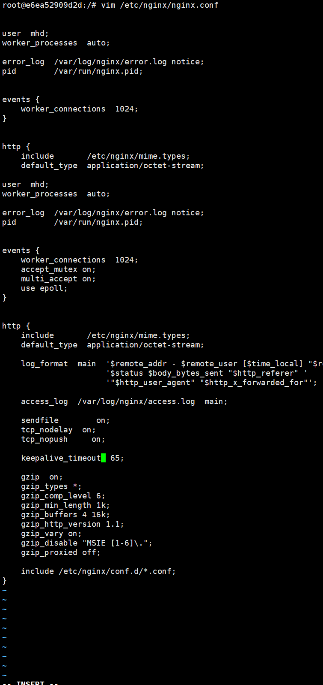

目录挂载：

```sh
docker cp nginx01:/etc/nginx/conf.d /usr/dokcer_nginx_data/conf_d
docker cp nginx01:/usr/share/nginx/html /usr/dokcer_nginx_data/html
docker cp nginx01:/var/log/nginx /usr/dokcer_nginx_data/log

-v /usr/dokcer_nginx_data/conf.d:/etc/nginx/conf.d  -v /usr/dokcer_nginx_data/log:/var/log/nginx  -v /usr/dokcer_nginx_data/html:/usr/share/nginx/html
```

`Docker` 中的 `Nginx `的文件目录：

```sh
# 后台运行(-d) 一个容器名(--name)为 ngix01 的nginx容器，将宿主机的 3344 端口映射给ngix01容器的 80 端口
[root@iZbp13mkmwsaey4fbsreozZ ~]# docker run -d --name nginx01 -p 3344:80 nginx
e6401b3b9e3f6cdb39db20556a3d99d31d0050497600027f2ec7c54dd86193b4

# 进入容器
[root@iZbp13mkmwsaey4fbsreozZ ~]# docker exec -it nginx01 /bin/bash
root@e6401b3b9e3f:/# whereis nginx
nginx: /usr/sbin/nginx /usr/lib/nginx /etc/nginx /usr/share/nginx

# html 文件所在路径
root@e6401b3b9e3f:/# cd /usr/share/nginx
root@e6401b3b9e3f:/usr/share/nginx# ls
html

# log 文件所在路径
root@e6401b3b9e3f:/# cd /var/log
root@e6401b3b9e3f:/var/log# ls
apt  btmp  dpkg.log  faillog  lastlog  nginx  wtmp

# conf.d 和 nginx.conf 文件所在路径
root@e6401b3b9e3f:/# cd etc/nginx
root@e6401b3b9e3f:/etc/nginx# ls
conf.d	fastcgi_params	mime.types  modules  nginx.conf  scgi_params  uwsgi_params

# 退出容器
root@e6401b3b9e3f:/# exit
exit

# 删除容器
docker rm -f 容器名

# 启动容器实现挂载
docker run --name nginx01 -d -p 3344:80 --restart always \
-v /usr/dokcer_nginx_data/conf.d:/etc/nginx/conf.d \
-v /usr/dokcer_nginx_data/log:/var/log/nginx \
-v /usr/dokcer_nginx_data/html:/usr/share/nginx/html \
-v /home/mhd:/home/mhd \
--network web --network-alias nginx \
nginx

# 启动PHP容器并将脚本放在 /home/xxx 目录下。
# 此时 /home/mhd 目录相当于一个「中转站」，连接着 Nginx 和 PHP，这样 Nginx 就能通过这个「中转站」访问 PHP 的脚本了。当然这样直接访问还远远不够，我们还需要在 Nginx 的配置文件进行配置，指定 PHP 的脚本在 home/mhd 下。
docker run -d --name php -v /home/mhd:/home/mhd --network web --network-alias php php:7.3-fpm


# 配置 PHP 脚本的访问路径
[root@iZbp13mkmwsaey4fbsreozZ ~]# vim /usr/dokcer_nginx_data/conf_d/conf.d/default.conf
# 修改内容如下：
server {
    listen 80;
    server_name 你的服务器域名;

    # ...... 其他配置
    location ~ \.php$ {   # 访问 .php 后缀的请求
        root           /home/mhd;	# 脚本的根目录
        fastcgi_pass   php:9000;	# 通过 php 网桥别名的 9000 端口连接上 PHP容器
        fastcgi_index  index.php;	# 默认首页
        fastcgi_param  SCRIPT_FILENAME  /home/mhd$fastcgi_script_name;  # 脚本的根目录
        include        fastcgi_params;
    }
    # ...... 其他配置
}


# 进入Nginx容器，容器名为 nginx01，在容器上执行交互式(interactive) bash shell，这将在容器 nginx01 中创建一个新的 Bash 会话。
docker exec -it nginx01 bash

# 进入 apt-get 配置目录
cd /etc/apt

# 执行备份命令，避免修改失败无法使用
cp sources.list sources.list.bak

# 同时执行 echo下的 4 行命令，修改成国内镜像源
echo "">sources.list \
echo "deb http://ftp2.cn.debian.org/debian/ buster main">>sources.list \
echo "deb http://ftp2.cn.debian.org/debian/debian-security buster/updates main">>sources.list \
echo "deb http://ftp2.cn.debian.org/debian/debian buster-updates main">>sources.list

# 更换镜像后无法更新 apt-get
root@e6ea52909d2d:/etc/apt# apt-get update
E: Type 'echo' is not known on line 1 in source list /etc/apt/sources.list
E: The list of sources could not be read.

root@e6ea52909d2d:/etc/apt# ls
apt.conf.d   preferences.d  sources.list.bak  trusted.gpg
auth.conf.d  sources.list   sources.list.d    trusted.gpg.d

# 查看sources.list文件内的信息
root@e6ea52909d2d:/etc/apt# cat sources.list

# 先将文件删除，将备份的文件恢复重新试一次
#将备份完成的文件改回来，即可。
rm sources.list
mv sources.list.bak sources.list
# 执行备份命令，避免修改失败无法使用
cp sources.list sources.list.bak
# 案例
root@e6ea52909d2d:/etc/apt# cp sources.list sources.list.bak
root@e6ea52909d2d:/etc/apt# echo "">sources.list
echo "deb http://ftp2.cn.debian.org/debian/ buster main">>sources.list
echo "deb http://ftp2.cn.debian.org/debian/debian-security buster/updates main">>sources.list
echo "deb http://ftp2.cn.debian.org/debian/debian buster-updates main">>sources.list
root@e6ea52909d2d:/etc/apt# apt-get update
Get:1 http://mirrors.tuna.tsinghua.edu.cn/debian buster InRelease [122 kB]
...
# 上述操作中将国内镜像源切换成如下，则更新成功
echo "">sources.list
echo "deb http://ftp2.cn.debian.org/debian/ buster main">>sources.list
echo "deb http://ftp2.cn.debian.org/debian/debian-security buster/updates main">>sources.list
echo "deb http://ftp2.cn.debian.org/debian/debian buster-updates main">>sources.list

# 下载 vim
apt-get install -y vim
```

你可以将安装完 `vim `的新容器，变成新的镜像，不然每次启动初始的镜像，都要更新 `apt-get` 和安装 `vim`

```sh
docker commit nginx01 nginx:1.0
```

第一个 `nginx `是打包的容器名，而 `nginx:1.0` 则是打包成新镜像的名字和版本。构建新镜像后，可以把初始的镜像删除掉，保留也可以。

案例：要先退出容器在执行创建新镜像的命令

```sh
root@e6ea52909d2d:/etc/apt# docker commit nginx01 nginx:1.0
bash: docker: command not found
# 退出容器
root@e6ea52909d2d:/etc/apt# exit
exit
[root@iZbp13mkmwsaey4fbsreozZ ~]# docker commit nginx01 nginx:1.0
sha256:4f7470669f71a37c80c3a955d8e1044c21d6a921e6a1e9d5109d76cae89f5c94
```

**配置 Nginx 用户权限和缓存等**



问题：

1、访问测试的`index.php`页面时无法访问。


### 参考资料

[下载 vim 的国内镜像源](https://www.debian.org/mirror/list)

