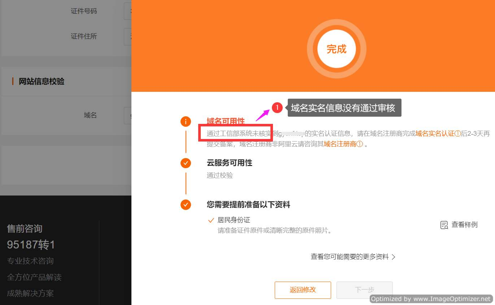
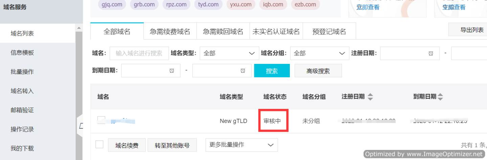
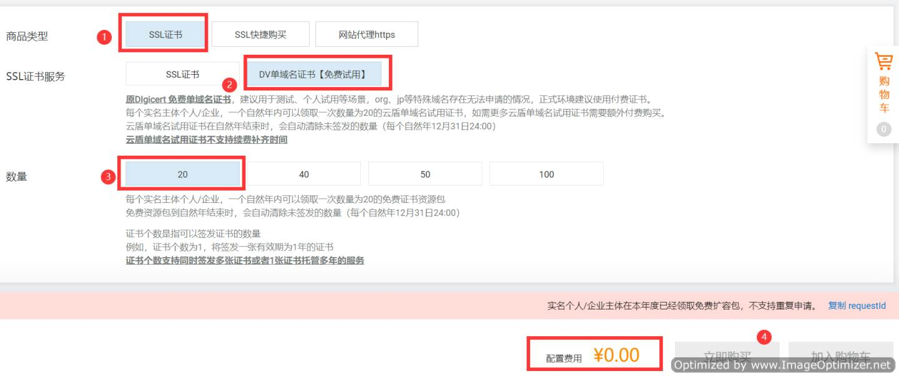
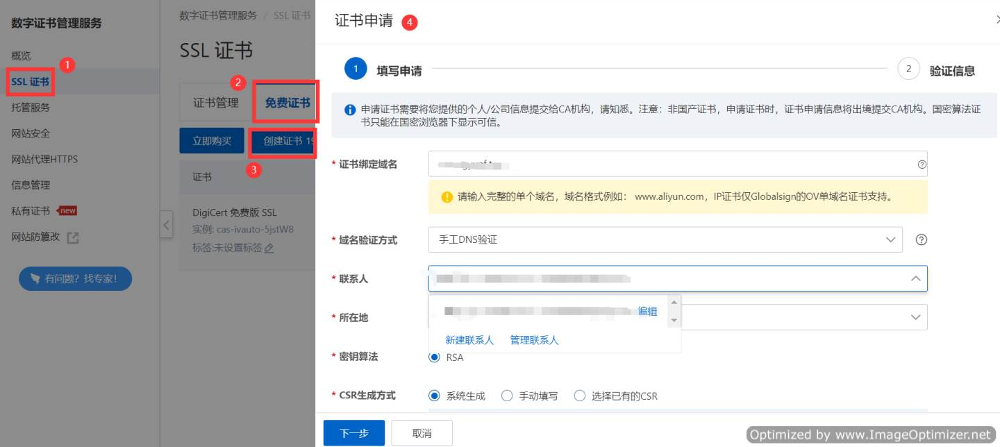
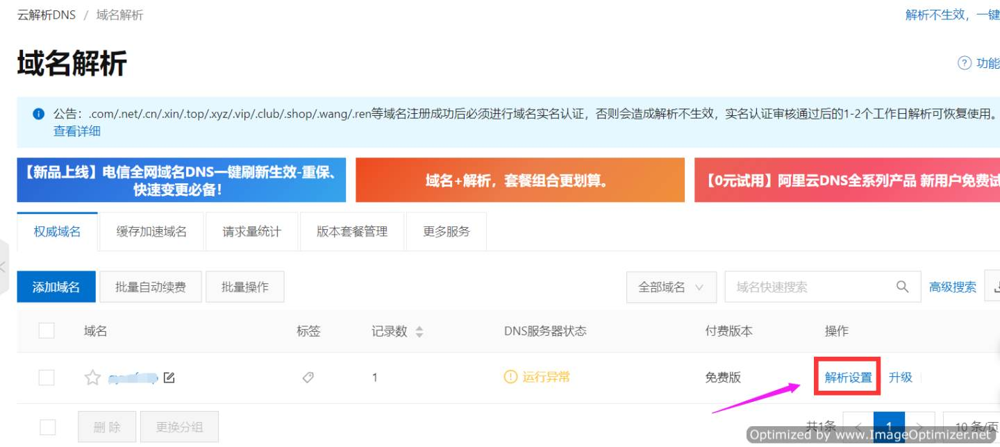
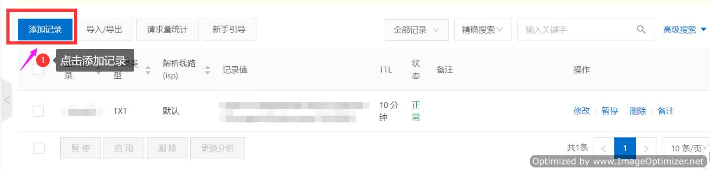
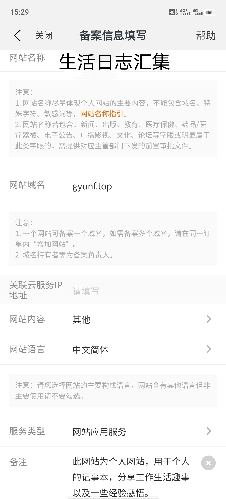
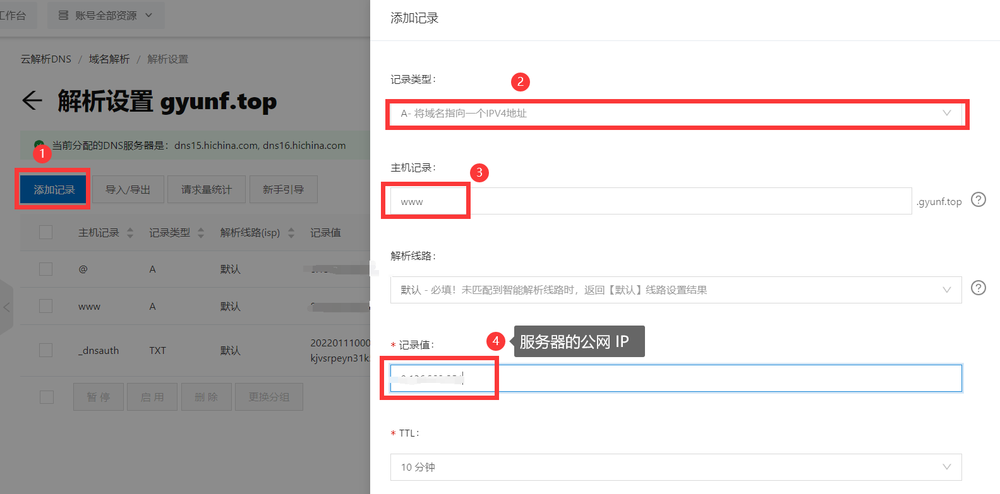

## 域名备案及SSL证书

下文中购买的产品都是在阿里云平台购买的，所有产品及其设置都可以通过控制台页面左上角的三横杠来查找，如果是第一登录的话可以在`产品`处看到阿里云的所有产品。

### 1、域名购买、认证

> 购买域名 -> 填写信息模板（第一购买域名）-> 域名 ICP 备案（需要域名状态通过审核）
>

域名我是在阿里云买的，你也可以在其他平台购买。购买域名后需要等域名实名信息通过审核，然后进行域名备案，如下图所示：

问题：域名实名信息没有通过审核。

域名状态为审核中，需要等到审核完后认证成功，刚认证成功的域名需要等待 2-3 天才能备案。在这之前你可以先申请`SSL`证书，

### 2、购买免费的 SSL 证书

直接在首页搜索`SSL证书`，然后点击`选购SSL证书`

然后购买时选择商品类型：`SSL证书`，SSL 证书服务：`DV 单域名证书【免费试用】`，数量：`20`，如果有变化的话你可以在官网查找一下有关域名的文档，不懂的都可以在官网查找资料，一般都会写得很清楚。如果操作很难又没有详细的介绍文档的话那么这个平台的产品肯定是很难卖出去的。

证书申请：购买完`SSL证书`后需要调交免费证书申请

> 找到数字证书管理服务 -> SSL 证书 -> 点击免费证书 -> 点击创建证书

然后填写证书申请信息，密钥算法：`RSA`，`CSR`生成方式：`系统生成`

申请证书成功后，需要`解析设置`验证域名

添加域名解析：

解析记录的信息根据申请证书的提示进行填写即可。

### 3、ICP 备案（域名备案）

可以在阿里云官网首页点击`ICP 备案`，也可以通过下载`阿里云 APP`然后在手机上备案，我是在手机上备案的。

网站名称：`生活日志汇集`

服务类型：`网站应用服务`

备注：`此站为个人网站，用于个人的记事本，分享工作生活趣事以及一些经验感悟`

需要身份证正反面照和人脸识别等材料，提交完材料后阿里云会审核，如果有问题的话会有客服打电话给你教你修改，所以不用太担心。

### 4、域名解析

在控制台中找到域名解析，然后点击添加记录进行域名解析配置。

A类型:就是指向我们服务器地址。

`cname`类型:解析到另一个域名。 （比如解析到`Github`的域名时，记录值就填`gyf110.github.io`）

解析就是指向的意思你拥有了一个域名后，可以不断创造子域名，比如`a`解析到`B`，访问`a`就访问到了`B`

首先，我们创建一个 A 类型解析s

> `@`是默认主域名,就是`xxx.com`
>
> 记录值就是服务器的`ip`地址

