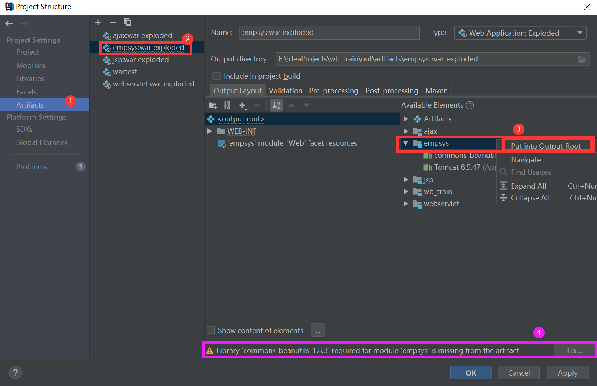

## 关于添加 lib 库文件的问题

将项目依赖的 `JAR `包复制到`lib`文件夹中，且`Add As Library`后还是报如下错误。

报错信息：`Library 'XXX' required for module 'empsys' is missing from the artifact`

报错原因：直接将项目依赖的 `JAR `包复制到`lib`文件夹中没有加入到项目的`artifact`中。

### 其他添加`JAR`包的方法

一、通过`Modules`的`Dependencies`添加：(推荐)

1. 打开` File -> Project Structure `

2. 单击` Modules -> Dependencies -> "+" -> "Jars or directories"`选择要添加进项目的`JAR`包和文件夹

3. `Apply -> OK`

二、通过`Libraries`添加

1. 打开` File -> Project Structure`

2. 单击 `Modules -> Dependencies`，对于新导入的项目，会自动导入`lib`目录下的相关`jar`包，我们需要将这些自动添加进来的`jar`包删除
3. 单击` Libraries -> "+" -> "Java" -> 选择我们导入的项目主目录，点击OK`。此时会弹出`library will be added to the selected  modules`（将库添加到模块中），在弹出的方框中点击`Cancel`取消。此时，lib目录创建成功。然后在此目录中添加所需要的`JAR`包。
4. 回到`Modules`菜单，选中之前导入的项目，点击`Dependencies`，点击“+” -> “Library”，将刚才创建成功的`Library`目录加入。
5. 将不是项目`lib`目录下的其他`jar`包（如：`tomcat`相关`jar`包），也通过该方式加入。

### 全局库

可以在`idea`中设置一个文件夹为`Global Libraries`(全局库)，全局库一旦设置完成可以在所有项目中直接导入。

1. 打开` File -> Project Structure`
2. 点击`Global Libraries -> “+” -> Java -> 这里选择的文件夹即为以后的全局库`，要求`jar`包直接存在这个文件夹中，**不能有二级目录**。
3. 回到`Modules`菜单，选中之前导入的项目，`点击Dependencies，点击“+” -> “Library”`，将刚才创建成功的`Library`目录加入。
4. 最后别忘了添加到根目录，``Artifacts` -> 选择对应的项目或模块 -> Output Layout -> Available Elements -> 选择对应的项目或模块并右键 -> Put into Output Root`

### 参考资料

`https://blog.csdn.net/zwj1030711290/article/details/56678353/`

`https://blog.csdn.net/a755199443/article/details/89192230#2`
