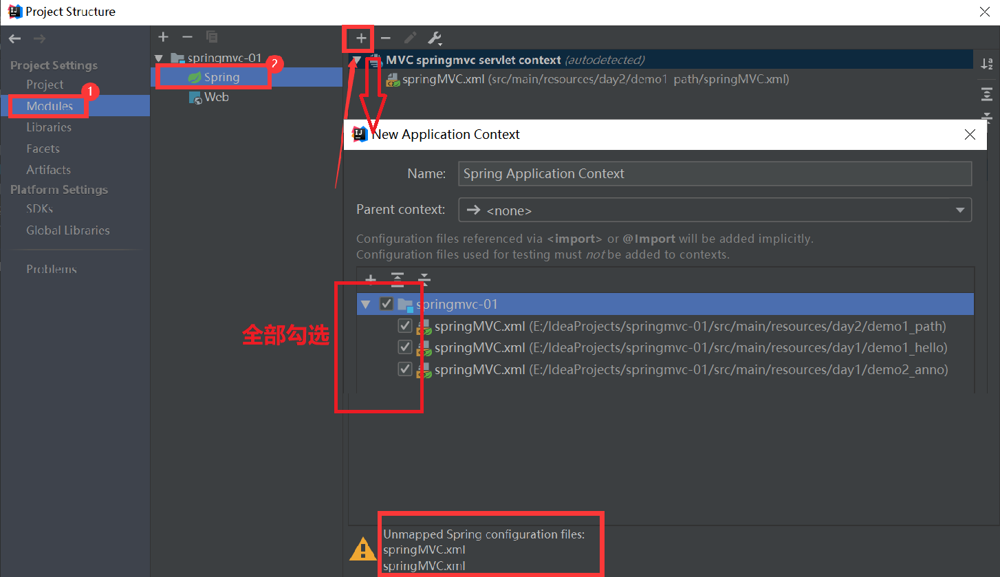

## 导入spring项目

1、复制`spring`项目的问题

问题描述：打开`spring`项目后弹窗提示如下信息

> Unmapped Spring configuration files found. Please configure Spring facet or use 'Create Default Context' to add one including all unmapped files. 

原因是`web`工程中的`spring`配置文件没有被``IDEA``所管理。

解决方案：告诉``IDEA``配置文件的位置，在`Project Structure -> Modules -> 选择报Unmaped Spring configuration files警告的模块 -> 点击最右边窗口的“+”号 -> 勾选对应的 Spring 配置文件 -> 点击OK -> Apply`。

